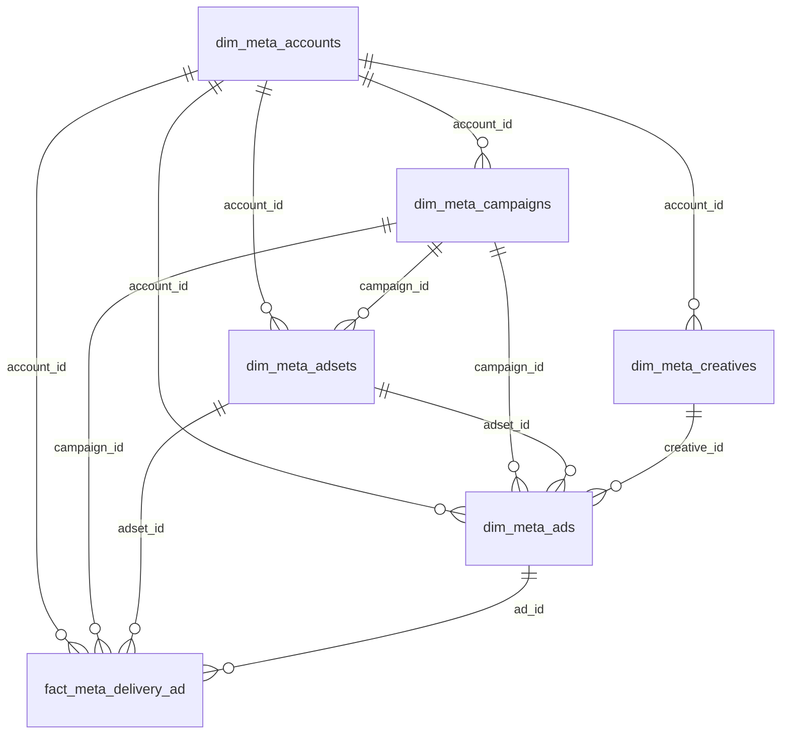

# Power BI Data Model Guide

This document describes the current reporting ERD for this project and the recommended way to model it in Power BI.

## Goal

Use a clean, low-maintenance reporting model that:

- centers on `fact_meta_delivery_ad`
- avoids unnecessary many-to-many relationships
- keeps cross-filtering predictable
- uses `dim_meta_ads` as the bridge to `dim_meta_creatives`

## Current Reporting ERD

The physical schema in the project currently supports this reporting structure:



## Table Roles

### Core fact

- `fact_meta_delivery_ad`: the main reporting fact table at ad/day grain

Key columns:

- `ad_id`
- `date_start`
- `account_id`
- `campaign_id`
- `adset_id`
- performance metrics like `spend`, `impressions`, `reach`, `clicks`

### Main dimensions

- `dim_meta_ads`: the most important bridge dimension
- `dim_meta_creatives`: creative copy and media metadata
- `dim_meta_accounts`: account-level metadata
- `dim_meta_campaigns`: campaign names and account linkage
- `dim_meta_adsets`: ad set names and campaign linkage

### Optional enrichment

- `dim_meta_account_registry`: profile and include/exclude metadata
- `dim_meta_ads_settings`: extra ad settings fields; use only if you specifically need settings beyond `dim_meta_ads`

### Not for Power BI reporting

- `meta_accounts_raw`
- `meta_campaigns_raw`
- `meta_adsets_raw`
- `meta_ads_raw`
- `meta_creatives_raw`
- `meta_insights_raw`
- `meta_ads_previews_raw`

These are staging/raw replay tables, not reporting tables.

## Recommended Power BI Model

For Power BI, the cleanest model is a star schema with `fact_meta_delivery_ad` in the center.

Recommended first version:

- `fact_meta_delivery_ad`
- `dim_meta_ads`
- `dim_meta_creatives`
- `dim_meta_accounts`
- `DimDate`

Add these only if needed:

- `dim_meta_campaigns`
- `dim_meta_adsets`
- merged account registry attributes

This gives you:

- ad performance from the fact
- account filters from `dim_meta_accounts`
- creative filters and creative attributes from `dim_meta_creatives`
- stable joins without needing extra API endpoints

## Relationships to Create in Power BI

Create these relationships as `Single` direction and `1:*` where possible.

| From table | From column | To table | To column | Cardinality | Direction |
|---|---|---|---|---|---|
| `DimDate` | `Date` | `fact_meta_delivery_ad` | `date_start` | `1:*` | Single |
| `dim_meta_accounts` | `account_id` | `fact_meta_delivery_ad` | `account_id` | `1:*` | Single |
| `dim_meta_campaigns` | `campaign_id` | `fact_meta_delivery_ad` | `campaign_id` | `1:*` | Single |
| `dim_meta_adsets` | `adset_id` | `fact_meta_delivery_ad` | `adset_id` | `1:*` | Single |
| `dim_meta_ads` | `ad_id` | `fact_meta_delivery_ad` | `ad_id` | `1:*` | Single |
| `dim_meta_creatives` | `creative_id` | `dim_meta_ads` | `creative_id` | `1:*` | Single |

## Important Cleanup Before Joining

There is one naming inconsistency in the current schema:

- `dim_meta_accounts` uses `id`
- most other tables use `account_id`

In Power BI, rename `dim_meta_accounts[id]` to `account_id` in Power Query before creating relationships.

You should also treat `dim_meta_account_registry` as an extension of accounts, not as a separate hub table.

## Best Practice Join Strategy

### Recommended path

Use this path for most reporting:

`fact_meta_delivery_ad -> dim_meta_ads -> dim_meta_creatives`

This is the key improvement in the current design. It means:

- the fact joins to ads by `ad_id`
- ads joins to creatives by `creative_id`
- you do not need to connect the fact directly to creatives

### Why this is the right shape

- it keeps the fact at its natural grain
- it avoids many-to-many relationships
- it preserves the real business hierarchy
- it mirrors the ETL logic, where ads bridge performance to creatives

## What to Avoid in Power BI

- do not join fact tables to each other
- do not use bidirectional filtering unless there is a very specific reason
- do not load raw tables into the model
- do not load both `dim_meta_ads` and `dim_meta_ads_settings` unless you really need both
- do not connect `dim_meta_creatives` directly to `fact_meta_delivery_ad`

## Simplest Useful Model

If you want the fastest clean start, use only:

- `fact_meta_delivery_ad`
- `dim_meta_ads`
- `dim_meta_creatives`
- `dim_meta_accounts`
- `DimDate`

This is enough for:

- spend, impressions, reach, clicks
- filtering by account
- slicing by ad
- slicing by creative name, CTA, title, body, image/video fields

You can add campaigns and ad sets later if you need dedicated campaign/adset dimensions.

## Power Query Steps

### 1. Rename the account key

Use this in Power Query for `dim_meta_accounts`:

```powerquery
= Table.RenameColumns(dim_meta_accounts, {{"id", "account_id"}})
```

### 2. Merge account registry into accounts

Use this to enrich accounts with profile metadata:

```powerquery
= Table.NestedJoin(
    dim_meta_accounts,
    {"account_id"},
    dim_meta_account_registry,
    {"account_id"},
    "registry",
    JoinKind.LeftOuter
)
```

After that, expand:

- `profile_name`
- `include_in_etl`
- `notes`

### 3. Create a date table

Use this DAX table:

```DAX
DimDate =
ADDCOLUMNS(
    CALENDAR(
        MIN('fact_meta_delivery_ad'[date_start]),
        MAX('fact_meta_delivery_ad'[date_start])
    ),
    "Year", YEAR([Date]),
    "Month No", MONTH([Date]),
    "Month", FORMAT([Date], "MMM yyyy")
)
```

## Multi-Fact Guidance

The project also has:

- `fact_meta_delivery_account`
- `fact_meta_delivery_campaign`
- `fact_meta_delivery_adset`

Use those only when you want reporting at those exact grains.

Recommended approach:

- start with `fact_meta_delivery_ad` as the primary reporting fact
- keep the other fact tables separate
- avoid putting measures from different grains in the same visual unless the model is designed for that

## Final Recommendation

If you want the cleanest Power BI setup right now, model it like this:

1. Use `fact_meta_delivery_ad` as the center.
2. Join `dim_meta_ads` to the fact on `ad_id`.
3. Join `dim_meta_creatives` to `dim_meta_ads` on `creative_id`.
4. Join `dim_meta_accounts` to the fact on `account_id` after renaming `id`.
5. Add `DimDate` on `date_start`.
6. Add campaigns and adsets only if you need their separate dimensions.

That gives you a tidy reporting model that matches the ETL and keeps Power BI behavior stable.
